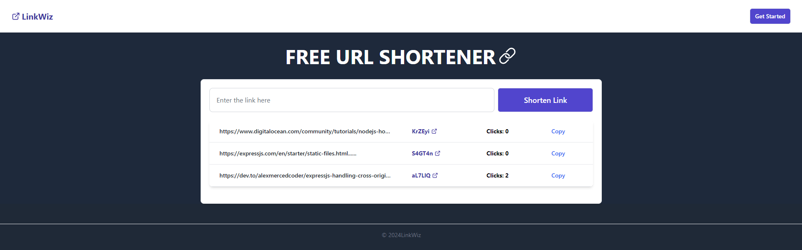

# LinkWiz - FREE URL SHORTENER

The main motivation of this project is to build a solution to mitigate the issue of large URL sending or parsing anywhere on the internet.

## Project Overview

LinkWiz is a URL shortener service that generates a unique 6-character shortId for each URL shortening request. This unique identifier is securely stored in the database, serving as a reference to the original URL. LinkWiz ensures proper data security and validation for every input. Users can also view insights for their links.

## UI


## Implementation

### Validation and URL Generations 

Used `nanoId` for generating `shortId` and `Joi` for schema validation.

- **Ensure the Uniqueness**:
  If the  `shortId` is already used then it will regenerate the id again and which will maintain the uniqueness of the short url.

### Link Insights

- **Clicks**
  Whenever the link is viewed, the click count will increase, and this information will be displayed on the home page.


## To Get Started

1. Clone this repository:

   ```bash
   git clone https://github.com/srijonashraf/LinkWiz.git
   ```

2. Install all dependencies and run the servers:

   ```bash
   cd backend
   npm i
   node index.js
   cd ../frontend
   npm i
   npx vite
   ```


## API Documentation

https://documenter.getpostman.com/view/28939375/2sA3duEsiS
